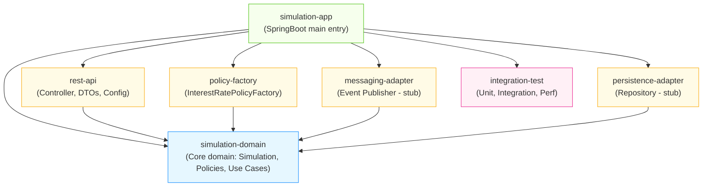
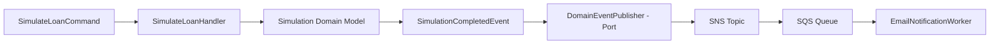

# 💡 Projeto: Simulador de Crédito

Este sistema permite simular condições de empréstimo com base em:

- Valor do empréstimo
- Prazo de pagamento (em meses)
- Data de nascimento do cliente

O sistema calcula:

- Valor total a pagar
- Valor de cada parcela
- Total de juros pagos

A taxa de juros é definida com base em diferentes estratégias (por idade, fixa, etc.).

---

## ▶️ Executando o Projeto

```bash
./gradlew bootRun
```

Para rodar os testes:

```bash
./gradlew test
```

---

## 🗂️ Estrutura de Diretórios

- `simulation-domain/` — Núcleo da simulação de crédito
  - `model/` — Entidades e value objects
  - `policy/` — Estratégias de cálculo de juros
  - `application/` — Casos de uso (ex: `SimulateLoan`)
- `rest-api/` — Camada REST (controladores, DTOs)
- `adapters/outbound/notification/` — Envio de e-mails
- `adapters/outbound/messaging/` — Publicação de eventos SNS
- `configuration/` — Beans, factories, configurações Spring
- `infra/` — Scripts de infraestrutura e setup local
- `integration-test/` — Testes de integração
- `test/` — Testes automatizados (unitários)

---

## ✅ Requisitos Atendidos

### Requisitos Funcionais (conforme enunciado do desafio)

- Simulação com base em:
  - Valor solicitado
  - Prazo em meses
  - Data de nascimento do cliente
- Taxas de juros variáveis por idade
- Resultado: total, parcela, juros
- Suporte a taxa fixa e estratégia customizada
- Processamento de alta volumetria
- Arquitetura modular, testada e documentada
- Suporte a múltiplas moedas
- Envio de e-mail com resultado da simulação
- Documentação Swagger

---

## 🔢 Políticas de taxa de juros implementadas

### 1. Taxa Variável por Faixa Etária

| Faixa Etária     | Taxa Anual |
|------------------|------------|
| Até 25 anos      | 5% ao ano  |
| De 26 a 40 anos  | 3% ao ano  |
| De 41 a 60 anos  | 2% ao ano  |
| Acima de 60 anos | 4% ao ano  |

> Implementado via `AgeBasedRatePolicy`.

### 2. Taxa Fixa

> Implementado via `FixedRatePolicy(taxa: BigDecimal)`

---

## ⚙️ Estratégia aplicada (Strategy Pattern)

```kotlin
val policy: InterestRatePolicy = AgeBasedRatePolicy()
// ou
val policy: InterestRatePolicy = FixedRatePolicy(BigDecimal("0.03"))

val simulateLoan = SimulateLoan(policy)
simulateLoan.execute(application)
```

Ou de forma dinâmica:

```kotlin
val policy = InterestRatePolicyFactory.from("age")
```

---

## 📡 Exemplo de Requisição REST

```json
POST /simulations
{
  "loan_amount": {
    "amount": "string",
    "currency": "string"
  },
  "customer_info": {
    "birth_date": "2019-08-24",
    "email": "user@example.com"
  },
  "months": 0,
  "policy_type": "fixed",
  "source_currency": "string",
  "target_currency": "string"
}
```

---

## 🧪 Testes

- Políticas de juros
- Casos de borda
- Application services
- Simulação completa
- Cobertura com Jacoco

---

## 🧰 Execução Local com Docker e Makefile

```bash
make localstack-start
make mongodb-start
make setup
```

Para destruir recursos:

```bash
make teardown
```

---

## 📑 Swagger

Acesse: [http://localhost:7000/swagger-ui.html](http://localhost:7000/swagger-ui.html)

---

## 🧠 Extensões Futuras

- Template HTML no e-mail
- Eventos Kafka
- Testes de performance

---

## 📊 Arquitetura (Mermaid)




